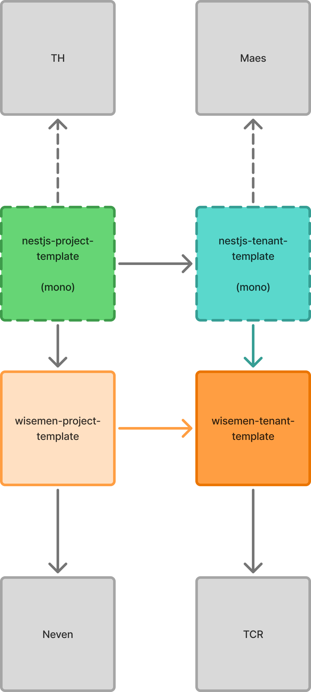

<p align="center">
  <a href="http://nestjs.com/" target="blank"></a>
</p>

# Wisemen NestJS project template

This repository contains the template backend API of a Wisemen project.

## Links

- API Documentation: https://localhost:3000/api/docs
- Async API Documentation for Event-Driven Architecture: https://localhost:3000/api/async-api
- ERD: https://localhost:3000/api/erd
- Linear: https://linear.app/wisemen/project/l10-backend-f7f8483b1bfc/overview

## Structure

The template contains a mono-repo like structure with a single NestJS application. This template is used by the [tenant](https://github.com/wisemen-digital/nestjs-tenant-template) and [wisemen](https://github.com/wisemen-digital/wisemen-project-template) template repositories.



## Prerequisites

- Node.js v26 or higher
- (p)npm package manager
- Any docker-compatible container runtime (for local development with containers)

## Installation

1. Create a `.env` file in the `apps/api` directory and configure the necessary environment variables. You can refer to the `.env.example` or `.env.test` file for guidance.

2. Run the containers

```bash
docker-compose up -d
```

3. Install the dependencies:

```bash
pnpm install
```

## Running the app

To ensure all packages are built before starting the development servers, you can use:

```bash
pnpm build
```

To run both the API and web applications in development mode, use the following command:

```bash
pnpm dev
```

This will expose the API at `http://localhost:3000`.
